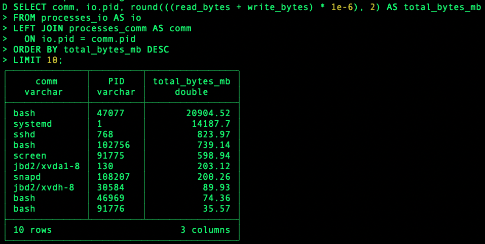

# Duckservability: Query Your Linux Systems
Duckservability is a DuckDB database schema for querying standard Linux systems via the `/proc` virtual file system which exposes real time kernel and process statistics. Traditionally files exposing these statistics have been aggregated via unix commandline tools. This project wraps these files in database tables that can be queried, joined, etc via SQL.

# Goals
Duckservability is primarily meant as a proof of concept. The overarching goal is to illustrate a class of things that can be done when the traditionally coupled storage and compute components of a database system are decoupled.

# Getting Started
Note that Duckservability presently only works on Linux and other Linux like systems.

1. Install [DuckDB](https://duckdb.org/docs/installation/)
1. Download the [latest release](https://github.com/MarkRoddy/duckservability/releases/download/latest/duckservability.duckdb) of the DuckDB file containing the Duckservibility schema.
1. Start DuckDB by running `duckdb duckservability.duckdb`
1. Start querying! To do so, run the `show tables;` command, or run one of the [example queries](https://github.com/MarkRoddy/duckservability/releases/download/latest/duckservability-example-queries.zip).

# Example Queries
Below are a few examples of questions you can ask with Ducservability. Additionally, see the [example-queries](tree/main/example-queries) directory for more examples.

## Processes with Most IO
Query processes that have performed the most IO operation in megabytes:
 

## Longest Running Proccesses by CPU Time

# Production Usage
Duckservability is presently in a proof of concept state. If you're looking for a more mature SQL system for querying OS data, take a look at the [osquery](https://github.com/osquery/osquery) project.
